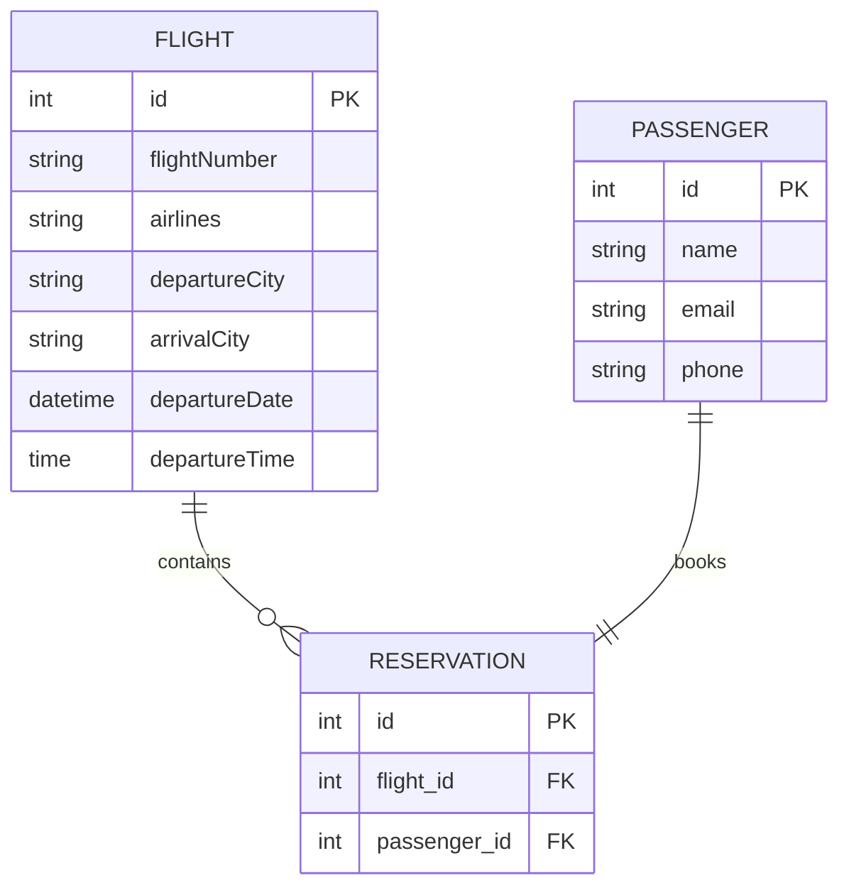
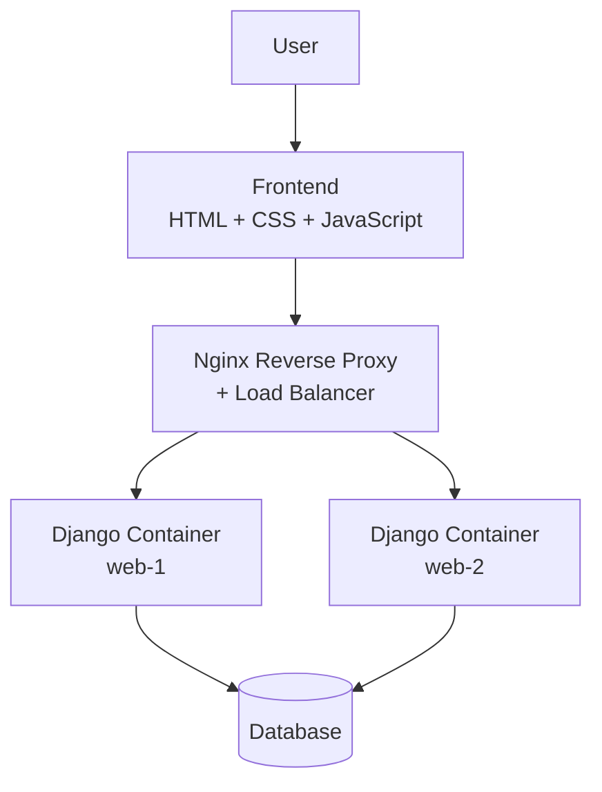

# ✈️ Flight Reservation System API

A production-style Flight Reservation Backend System built using Django and Django REST Framework with authentication, flight search, passenger reservation management, Dockerized deployment, and Nginx load balancing support.

This project demonstrates:

- REST API development
- Authentication using DRF Token Auth
- Dockerized Django deployment
- Nginx reverse proxy + load balancing
- Reservation system architecture
- Frontend integration using Vanilla JavaScript
- Environment-based configuration

---

# 🚀 Features

## ✅ Core Features

- Flight Management APIs (CRUD)
- Passenger Management APIs
- Reservation Management APIs
- Flight Search API
- Save Reservation API
- Token-based Authentication
- Input Validation
- Environment Variable Configuration

---

## ✅ DevOps & Deployment Features

- Dockerized Application
- Docker Compose Multi-Service Setup
- Nginx Reverse Proxy
- Nginx Load Balancer
- Multiple Django Containers (`web-1`, `web-2`)
- Environment-based settings

---

# 🏗️ Tech Stack

| Category | Technology |
|---|---|
| Backend | Python 3 |
| Framework | Django 5 |
| API Framework | Django REST Framework |
| Authentication | DRF Token Authentication |
| Database | PostgreSQL / SQLite |
| Deployment | Docker |
| Reverse Proxy | Nginx |
| Frontend | HTML + CSS + Vanilla JS |

---

# 📁 Project Structure

```bash
flights/
│
├── flightApp/
│   ├── models.py
│   ├── serializers.py
│   ├── views.py
│
├── flights/
│   ├── settings.py
│   ├── urls.py
│
├── nginx/
│   └── default.conf
│
├── docker-compose.yml
├── Dockerfile
├── .dockerignore
├── .env.docker
│
├── frontend/
│   └── index.html
│
└── manage.py
```

---

# 🧩 Database Models

The project contains three main entities:

---

## ✈️ Flight Model

Stores flight information.

| Field | Type |
|---|---|
| flightNumber | CharField |
| airlines | CharField |
| departureCity | CharField |
| arrivalCity | CharField |
| departureDate | DateTimeField |
| departureTime | TimeField |

---

## 👤 Passenger Model

Stores passenger details.

| Field | Type |
|---|---|
| name | CharField |
| email | CharField |
| phone | CharField |

---

## 🎫 Reservation Model

Maps passengers to flights.

| Relationship | Type |
|---|---|
| flight | ForeignKey → Flight |
| passenger | OneToOneField → Passenger |

---

# 🗂️ ER Diagram



---

# 🔄 API Architecture



---

# 🔐 Authentication

The application uses DRF Token Authentication.

## Generate Token

```http
POST /api-token-auth/
```

### Request

```json
{
  "username": "admin",
  "password": "password"
}
```

### Response

```json
{
  "token": "your_token_here"
}
```

---

## Use Token

Add token in request headers:

```http
Authorization: Token your_token_here
```

---

# 🌐 API Endpoints

## 🔹 Flight APIs

| Method | Endpoint | Description |
|---|---|---|
| GET | `/flights/` | Get all flights |
| POST | `/flights/` | Create flight |
| PUT | `/flights/{id}/` | Update flight |
| DELETE | `/flights/{id}/` | Delete flight |

---

## 🔹 Passenger APIs

| Method | Endpoint |
|---|---|
| GET | `/passengers/` |
| POST | `/passengers/` |

---

## 🔹 Reservation APIs

| Method | Endpoint |
|---|---|
| GET | `/reservations/` |
| POST | `/reservations/` |

---

# 🔍 Find Flights API

```http
POST /flights/findflights
```

## Request

```json
{
  "departureCity": "Kolkata",
  "arrivalCity": "Delhi",
  "departureDate": "2026-05-20"
}
```

---

# 💾 Save Reservation API

```http
POST /flights/savereservation
```

## Request

```json
{
  "flightNumber": 1,
  "name": "Aranya",
  "email": "aranya@gmail.com",
  "phone": "9876543210"
}
```

---

# 🧪 Serializer Validation

The project validates flight numbers using regex validation.

```python
^[A-Za-z0-9]*$
```

Only alphanumeric flight numbers are allowed.

---

# ⚙️ Environment Configuration

Configured using `.env.docker`.

Example:

```env
SECRET_KEY=your_secret_key
DEBUG=False
ALLOWED_HOSTS=localhost,127.0.0.1
DATABASE_URL=your_database_url
```

---

# 🐳 Docker Setup

The application is fully Dockerized.

---

## 📦 Docker Services

- Django Application
- PostgreSQL Database
- Nginx Reverse Proxy

---

# ▶️ Run Using Docker

## 1️⃣ Clone Repository

```bash
git clone <your-repo-url>
cd flights
```

---

## 2️⃣ Build Containers

```bash
docker compose build
```

---

## 3️⃣ Run Containers

```bash
docker compose up -d
```

---

## 4️⃣ Apply Migrations

```bash
docker compose exec web python manage.py migrate
```

---

## 5️⃣ Create Superuser

```bash
docker compose exec web python manage.py createsuperuser
```

---

# 🌍 Nginx Load Balancer

The project uses:

- Reverse Proxy
- Least Connection Load Balancing
- Multiple Django Containers

---

## 🔁 Load Balancing Strategy

```nginx
upstream django_cluster {
    least_conn;
    server web-1:8000;
    server web-2:8000;
}
```

This distributes traffic between multiple Django instances.

---

# 🖥️ Frontend

The frontend is built using:

- HTML
- CSS
- Vanilla JavaScript

Frontend Features:

- Login Page
- Flight Search
- Reservation Booking
- Token Storage
- API Integration

---

# 🔄 Request Flow

```text
User
 ↓
Frontend
 ↓
Nginx Reverse Proxy
 ↓
Django REST APIs
 ↓
Database
```

---

# 🧠 Important Concepts Demonstrated

- REST API Design
- Token Authentication
- Reverse Proxy
- Load Balancing
- Docker Networking
- Environment Variables
- Serializer Validation
- Django ORM Relationships
- CRUD Operations
- Multi-container Architecture

---

# 📌 Future Enhancements

- JWT Authentication
- Swagger/OpenAPI Documentation
- Payment Gateway Integration
- Booking History
- Seat Selection
- Email Notifications
- Kubernetes Deployment
- CI/CD Pipeline
- Redis Caching
- Celery Background Tasks

---

# 👨‍💻 Author

Aranya Majumdar

Backend Developer | Python Developer | DevOps Enthusiast

---

# 📄 License

This project is created for educational and portfolio purposes.